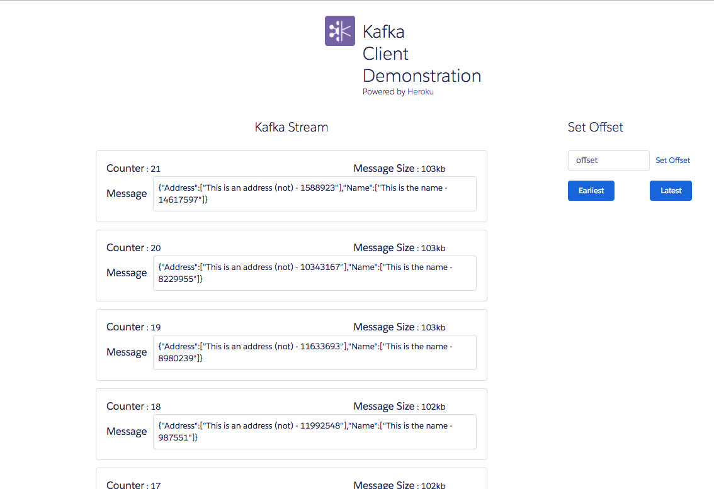

[Heroku 101](https://github.com/ibigfoot/heroku-101) | [Heroku 201](https://github.com/ibigfoot/heroku-201) | [Heroku 301](https://github.com/ibigfoot/heroku-301) | [Heroku 401](https://github.com/ibigfoot/heroku-401)

# Node.js Kafka Client
So let's shift tack a little and grab some code that is written in Node.js this time! We are going to deploy a simple node app that uses some websockets to consume events off the Kafka topic that we are currently populating.

Move back out of the generator and grab this code..
```
> cd ../
> git clone https://github.com/ibigfoot/heroku-301-client
```

And do the necessary to create your Heroku applications
```
> cd heroku-301-client
> heroku create troys-kafka-client
```

Watch everything happen and then attach Kafka

```
> heroku addons:attach <<kafka addon name>>
```

Again, we are going to want to use the same topic that created for the generator. 

```
> heroku config:set KAFKA_TOPIC=<<your topic here>>
```

Now, let's push our source code

```
> git push heroku master
```

When all is said and done, we should be able to just open our application

```
> heroku open
```

Not bad hey.. so sure, I could use some help with UX design.. but this illustrates the concept of producing and consuming events quite well. 
Let's see what happens if we scale

```
> cd ../my-kafka-generator
> heroku ps:scale worker=100:Standard-1x
```

Watch those messages fly by now on your app. 



Finally, let's turn everything off before we move onto our next excercise for the day

```
> heroku ps:scale worker=0
```

Now, if for some reason yours isn't working as described and you really aren't too bothered to debug it.. 

try clicking this button 

[](https://heroku.com/deploy)
